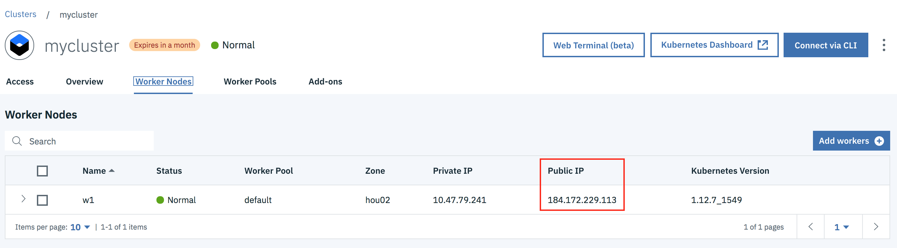

# Лабораторная работа

## Создание контейнерного приложения в IBM Cloud.

**Требования:**

 - Наличие аккаунта в IBM Cloud.
 - Установленные на локальной машине – Git, Docker, текстовый редактор.

## Этап 1. Создание кластера  Kubernetes в IBM Cloud.

В данной лабораторной работе будет использован демо-кластер Kubernetes, расположенный в IBM Cloud.

Для создания кластера необходимо выполнить следующие шаги:
- Перейти по адресу: https://cloud.ibm.com
- Войти  со своими учетными данными или создать новый аккаунт
- После успешного входа вы увидите следующий экран (рис.1).
- Необходимо раскрыть меню, нажав в левом верхнем углу на значок 

 
Рисунок 1.


- В раскрывшемся меню (рис. 2) необходимо выбрать опцию Kubernetes.


Рисунок 2.

- На открывшейся странице (рис.3) необходимо нажать на кнопку  Create Cluster

 
Рисунок 3.

- На странице создания кластера (рис. 4) необходимо убедиться, что выбран Cluster type – Free. Остальные значения надо оставить по-умолчанию и нажать кнопку Create Cluster.


Рисунок 4.


- Далее вы увидете страницу с описанием настроек для подключения (рис. 5), они понадобятся на следующих этапах.


Рисунок 5.

> На этом первый этап завершен


## Этап 2. Создание контейнерного приложения.

В рамках данного этапа будет создано простейшее Node.js приложение `Hello World`.  Данное приложение будет протестировано на локальном хосте.

Для создания и запуска приложения необходимо выполнить следующие шаги:

- Откройте терминальное окно
- Выполните следующую команду для того чтобы склонировать репозиторий с приложением: 
````
git clone https://github.com/albert-haliulov/2019-cloud-lab-for-sales.git
````

- Перейдите в папку с приложением
````
cd 2019-cloud-lab-for-sales
````

- В папке находится файл с именем `Dockerfile` следующего содержания:
````
FROM node:8

# Change working directory
WORKDIR "/app"

# Install app dependencies
# A wildcard is used to ensure both package.json AND package-lock.json are copied
# where available (npm@5+)
COPY package*.json ./

RUN npm install
# If you are building your code for production
# RUN npm ci --only=production

# Bundle app source
COPY . .

EXPOSE 8080

CMD ["npm", "start"]
````

- Используя файл `Dockerfile` запустите сборку Docker образа:

````
docker build --tag demoapp:1.0 .
````

- Проверьте, что образ создался:

````
docker images
REPOSITORY                                            TAG                  IMAGE ID            CREATED             SIZE
demoapp                                               1.0                  4e57ee7a2c15        8 seconds ago       899MB
````
- Запустите Docker контейнер с приложением:

````
docker run -d --name demoapp -p 8080:8080 demoapp:1.0
````

- Проверьте, что приложение запустилось:

````
docker ps
CONTAINER ID        IMAGE               COMMAND             CREATED             STATUS              PORTS                    NAMES
e70cfe226caf        demoapp:1.0         "npm start"         4 minutes ago       Up 4 minutes        0.0.0.0:8080->8080/tcp   demoapp
````

- Приложение доступно по адресу http://localhost:8080

> На этом второй этап завершен

## Этап 3. Установка и настройка утилит командой строки для работы с вашим кластером.

Для работы с кластером потребуется инструменты командной строки – `IBM Cloud CLI` и `kubectl`.

- Установка инструментов командой строки:

````
curl -sL https://ibm.biz/idt-installer | bash
````

- Залогинтесь в IBM Cloud:

````
ibmcloud login -a https://cloud.ibm.com --sso
````

- Пока кластер создается, мы создадим новое пространство имен в Docker реестре:
````
ibmcloud cr namespace-add cloudlab2019
````

- Залогинтесь в созданном прострастве:
````
ibmcloud cr login
````

- Создайте метку для локального Docker образа приложения, который мы до этого создали:

````
docker tag demoapp:1.0 us.icr.io/cloudlab2019/demoapp:1.0
````

- Загрузите локальный Docker образ в Docker реестр, находящийся в IBM Cloud:

````
docker push us.icr.io/cloudlab2019/demoapp:1.0
````

- Проверьте, что образ загрузился:
````
ibmcloud cr image-list
Listing images...

REPOSITORY                        TAG   DIGEST         NAMESPACE      CREATED         SIZE     SECURITY STATUS   
us.icr.io/cloudlab2019/demoapp    1.0   c442603380b9   cloudlab2019   7 minutes ago   346 MB   Scanning...   

OK
````

**Только после того как ваш кластер будет создан, можно приступать к следующим шагам.**

- Настройте окружение командой строки для работы с кластером в том регионе в котором вы создали экземпляр сервиса Kubernetes:
````
ibmcloud ks region-set us-south
````
````
ibmcloud ks cluster-config mycluster
````

- Выполните команду, которая является результатом выполнения предыдущей команды. Ниже указан пример - он не обязательно будет совпадать с вашим.
````
export KUBECONFIG=/Users/$USER/.bluemix/plugins/container-service/clusters/mycluster/kube-config-hou02-mycluster.yml
````

- Проверьте что все настроено верно, выполнив команду выводящую список узлов кластера:

````
kubectl get nodes
NAME           STATUS    AGE       VERSION
10.47.79.241   Ready     10m       v1.12.7+IKS
````

> На этом третий этап завершен

## Этап 4. Установка и запуск приложения в IBM Cloud.

- В папке находится файл с именем `demoapp.yaml` следующего содержания:

````
apiVersion: apps/v1
kind: Deployment
metadata:
  name: demoapp-deployment
  labels:
    app: demoapp
spec:
  replicas: 1
  selector:
    matchLabels:
      app: demoapp
  template:
    metadata:
      labels:
        app: demoapp
    spec:
      containers:
      - name: demoapp-container
        image: us.icr.io/cloudlab2019/demoapp:1.0
        ports:
        - containerPort: 8080
---
apiVersion: v1
kind: Service
metadata:
  name: demoapp-service
spec:
  type: NodePort
  selector:
    app: demoapp
  ports:
  - protocol: TCP
    port: 8080
    targetPort: 8080
    nodePort: 31000
````

- Используя файл `demoapp.yaml` запустите установку приложения на ваш кластер:

````
kubectl apply -f demoapp.yaml
deployment "demoapp-deployment" created
service "demoapp-service" created
````

- Проверьте, что установка приложения прошла успешно:

````
kubectl get deployments
NAME                 DESIRED   CURRENT   UP-TO-DATE   AVAILABLE   AGE
demoapp-deployment   1         1         1            1           35s
````

````
kubectl get pods
NAME                                  READY     STATUS    RESTARTS   AGE
demoapp-deployment-5f94b8fd7f-t48pn   1/1       Running   0          54s
````

````
kubectl get services
NAME              CLUSTER-IP       EXTERNAL-IP   PORT(S)          AGE
demoapp-service   172.21.197.105   <nodes>       8080:31000/TCP   3m
````

- Чтобы открыть приложение, необходимо узнать публичный IP адрес вашего кластера. Для этого вернитесь в консоль IBM Cloud и откройте страницу созданного вами кластера. Публичный IP адрес указан на вкладке `Worker Nodes` как на картинке (рис.6).


Рисунок 6.

Приложение доступно по публичному IP адресу и соответствующему порту, например, в данном случае `demoapp` доступен по адресу http://184.172.229.113:31000. Вам нужно указать IP адрес своего кластера вместо <Public_IP> в адресе вызова приложения: http://<Public_IP>:31000

## На этом четвертый этап и вся лабораторная работа успешно завершены.

